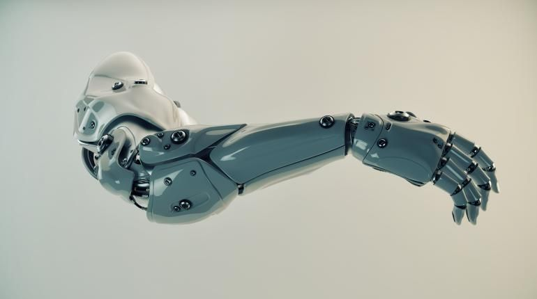

<!DOCTYPE html>
<html lang="en" dir="ltr">
  <head>
    <meta charset="utf-8">
    <title>robotics</title>

    <link rel="stylesheet" href="cssfortrial.css">
    <link rel="preconnect" href="https://fonts.gstatic.com">
    <link href="https://fonts.googleapis.com/css2?family=Roboto+Mono&display=swap" rel="stylesheet">
    <link href="https://fonts.googleapis.com/css2?family=Roboto+Mono:wght@100;300;400&family=Space+Grotesk:wght@300&display=swap" rel="stylesheet">
    <link href="https://fonts.googleapis.com/css2?family=Raleway:wght@100&family=Roboto+Mono:wght@100;300;400&family=Space+Grotesk:wght@300&display=swap" rel="stylesheet">
    </head>
  <body>
    <header>
      <table >
        <tr>
          <td >
            <nav class="check2">
            <ul>
              <li class="nav_elements"><a href="trial.html" style="text-decoration:none">Home</a></li>
              <li class="nav_elements"><a href="Study.html" style="text-decoration:none">Study</a></li>
              <li class="nav_elements"><a href="https://ardop.github.io/index.html" style="text-decoration:none">Ardop</a></li>
            </ul>
          </nav></td>
          <td  class="check" align="right"><a href="contact.html" style="text-decoration:none">contact</a></td>
        </tr>

      </table>
    <h1 >Robotic Arm</h1></header>

    <section class="about_arm">
    <table>
      <tr>
        <td class="content1" ></td>
        <td>
          
A robotic arm is a type of mechanical arm, usually programmable, with similar functions to a human arm; the arm may be the sum total of the mechanism or may be part of a more complex robot.
            The links of such a manipulator are connected by joints allowing either rotational motion (such as in an articulated robot) or translational (linear) displacement.
            The links of the manipulator can be considered to form a kinematic chain. The terminus of the kinematic chain of the manipulator is called the end effector and it is analogous to the human hand.
             However, the term "robotic hand" as a synonym of the robotic arm is often proscribed.

        </td>
      </tr>
    </table>
    </section>
    <section class="info_arm">
    <table>
      <tr>
        <h2 align="center">Humanoid Robotic arm</h2>
        <td >

          

            A mechanical arm is a machine that mimics the action of a human arm. Mechanical arms are composed of multiple beams connected by hinges powered by actuators.
            One end of the arm is attached to a firm base while the other has a tool. They can be controlled by humans either directly or over a distance.
            A computer-controlled mechanical arm is called a robotic arm. However, a robotic arm is just one of many types of different mechanical arms.
             Mechanical arms can be as simple as tweezers or as complex as prosthetic arms.
            In other words, if a mechanism can grab an object, hold an object, and transfer an object just like a human arm, it can be classified as a mechanical arm.
             Recent advancements have been brought about to lead future improvements in the medical field with prosthetics and with the mechanical arm in general.
             When mechanical engineers build complex mechanical arms, the goal is for the arm to perform a task that ordinary human arms can not complete.
          

        </td>
        <td></td>
      </tr>
    </table>
    </section>
    <footer>
      my details
    </footer>
  </body>
</html>
